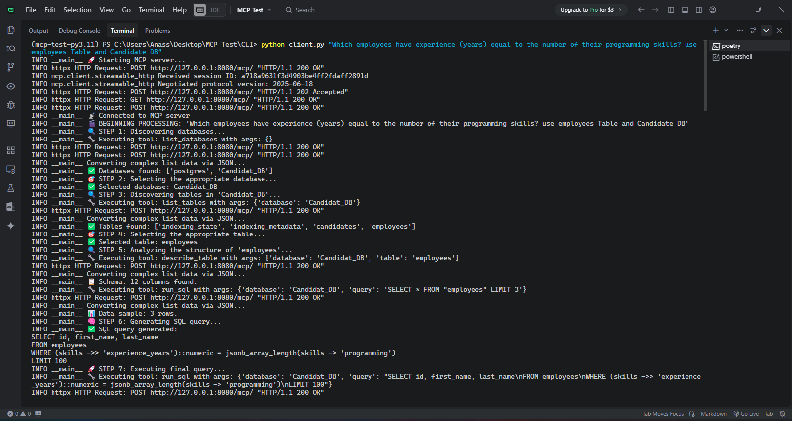
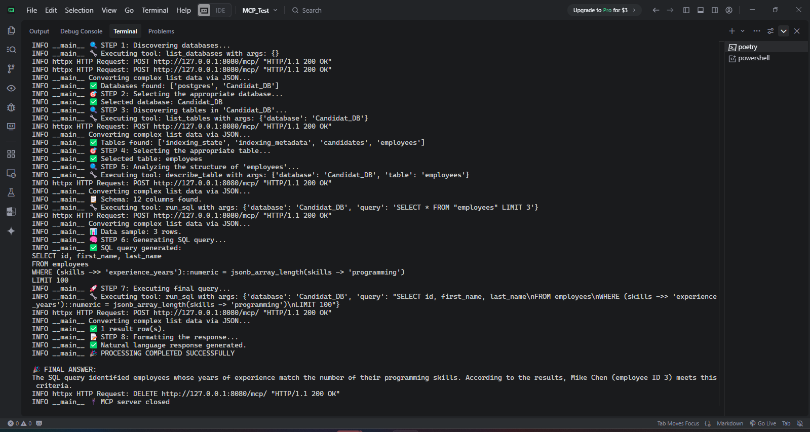
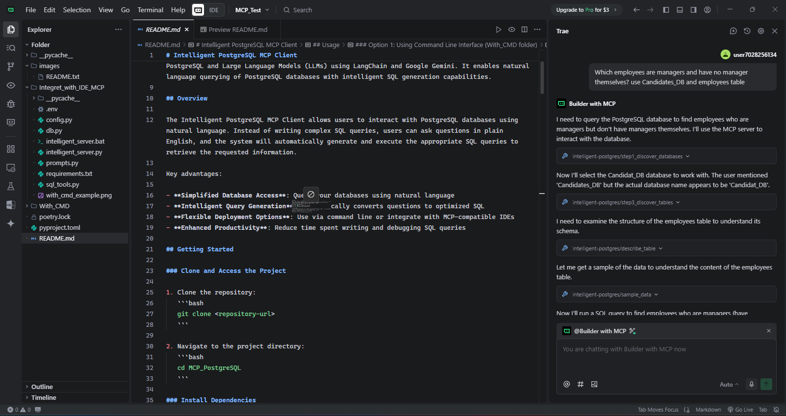
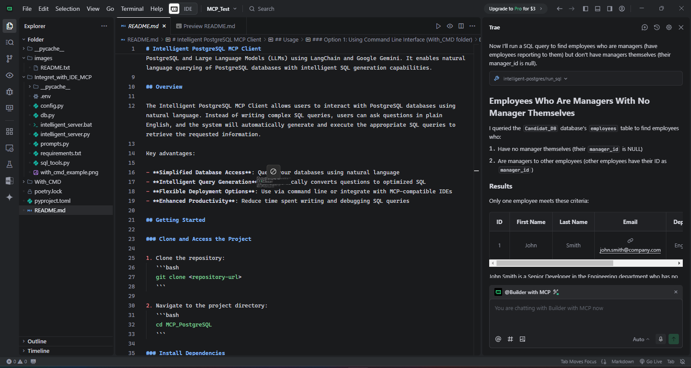
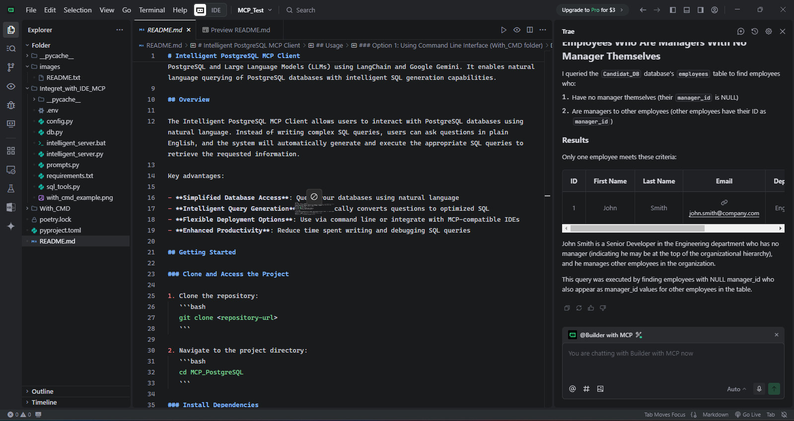

# Intelligent PostgreSQL MCP Client

This project provides a powerful integration between a Model Context Protocol (MCP) server for PostgreSQL and Large Language Models (LLMs) using LangChain and Google Gemini. It enables natural language querying of PostgreSQL databases with intelligent SQL generation capabilities.

## Overview

The Intelligent PostgreSQL MCP Client allows users to interact with PostgreSQL databases using natural language. Instead of writing complex SQL queries, users can ask questions in plain English, and the system will automatically generate and execute the appropriate SQL queries to retrieve the requested information.

Key advantages:

- **Simplified Database Access**: Query your databases using natural language
- **Intelligent Query Generation**: Automatically converts questions to optimized SQL
- **Flexible Deployment Options**: Use via command line or integrate with MCP-compatible IDEs
- **Enhanced Productivity**: Reduce time spent writing and debugging SQL queries

## Getting Started

### Clone and Access the Project

1. Clone the repository:
   ```bash
   git clone https://github.com/anass1209/MCP_PostgreSQL.git
   ```

2. Navigate to the project directory:
   ```bash
   cd MCP_PostgreSQL
   ```

### Install Dependencies

You can install dependencies using Poetry (recommended), pip, or UV:

**Using Poetry:**
```bash
poetry install
```

**Using pip:**
```bash
pip install -r requirements.txt
```

**Using UV:**
```bash
uv pip install -r requirements.txt
```

## About MCP

MCP (Model Context Protocol) is a protocol that enables secure, controlled access to external resources for AI models. In this project, it provides a standardized way for LLMs to interact with PostgreSQL databases while maintaining security and proper access controls.

Benefits of using MCP:

- **Security**: Controlled access to database resources
- **Standardization**: Consistent interface for AI models to interact with databases
- **Extensibility**: Easy to add new capabilities and tools
- **Interoperability**: Works with various LLMs and database systems

## Project Structure

This repository contains two main implementations:

### 1. With_CMD

Use this folder if you want to interact with the MCP server through command line or LCI:

- `client.py`: Client application that connects to the MCP server using an LLM
- `server.py`: MCP server implementation
- `config.py`: Configuration settings for database connections and API keys
- `db.py`: Database connection and management utilities
- `sql_tools.py`: SQL query tools and utilities
- `prompts.py`: LLM prompts for intelligent SQL generation
- `.env`: Environment variables for API keys and database configuration

### 2. Integret_with_IDE_MCP

Use this folder if you want to integrate with MCP-compatible IDEs like Claude Desktop:

- `intelligent_server.py`: MCP server that exposes PostgreSQL functionalities with intelligent SQL generation
- `intelligent_server.bat`: Batch script to start the intelligent MCP server
- `config.py`: Configuration settings for database connections and API keys
- `db.py`: Database connection and management utilities
- `sql_tools.py`: SQL query tools and utilities
- `prompts.py`: LLM prompts for intelligent SQL generation
- `.env`: Environment variables for API keys and database configuration

### Common Files

- `pyproject.toml`: Poetry dependency management file
- `poetry.lock`: Lock file for Poetry dependencies

## Usage

### Prerequisites

1. Ensure PostgreSQL is running and accessible with the connection parameters defined in your configuration.

2. Set up your environment variables in the `.env` file:
   ```
   GOOGLE_API_KEY="your-gemini-api-key"
   PG_HOST="localhost"
   PG_PORT=
   PG_USER=""
   PG_PASSWORD=""
   PG_DEFAULT_DB=""
   ```

### Option 1: Using Command Line Interface (With_CMD folder)

1. Navigate to the With_CMD folder:
   ```bash
   cd With_CMD
   ```

2. Run the client with a specific question:
   ```bash
   python client.py "What tables are in the Candidat_DB database?"
   ```
   
   Or without arguments for interactive mode:
   ```bash
   python client.py
   ```
   Then enter your question when prompted.

#### Example of With_CMD Usage




*The image above shows an example of querying a PostgreSQL database using the command line interface. The user asks a question in natural language, and the system generates and executes the appropriate SQL query to retrieve the requested information.*

### Option 2: Using MCP-Compatible IDE (Integret_with_IDE_MCP folder)

1. Navigate to the Integret_with_IDE_MCP folder:
   ```bash
   cd Integret_with_IDE_MCP
   ```

2. Configure your IDE to connect to the MCP server:

   Add this JSON configuration to your IDE's MCP settings:
   ```json
   {
     "mcpServers": {
       "intelligent-postgres": {
         "command": "Path to intelligent_server.bat",
         "args": [],
         "cwd": "Path to the MCP_Test folder",
         "env": {
           "PG_HOST": "localhost",
           "PG_PORT": "5432",
           "PG_USER": "Your database username",
           "PG_PASSWORD": "Your database password",
           "PG_DEFAULT_DB": "Your default database",
           "GOOGLE_API_KEY": "Your API key",
           "PYTHONIOENCODING": "utf-8",
           "PYTHONUNBUFFERED": "1"
         }
       }
     }
   }
   ```

3. Update `intelligent_server.bat` if needed:
   - If you use UV, replace `poetry run python intelligent_server.py` in file .bat with `uv run python intelligent_server.py` and use absolute path if necessary

4. Add this task to your IDE and restart to activate your new MCP "Intelligent-postgres"

The client will automatically connect to the MCP server, access PostgreSQL through this server, and use an LLM to answer questions about your databases.

#### Example of IDE MCP Integration





*The image above demonstrates how to interact with PostgreSQL databases using natural language queries through an MCP-compatible IDE. The IDE provides a seamless interface for asking questions and receiving formatted results directly in your development environment.*

## Best Practices for Queries

- **Specify Database and Table**: When you have multiple databases and tables, always specify the database and table in your query for more accurate results. For example:
  ```
  Which employees are managers and have no manager themselves? use Candidates_DB and employees table
  ```

- **Be Specific**: Provide clear, specific questions that include all relevant information about the data you're looking for.

- **Include Context**: When possible, include context about the data structure or relationships you're querying.

## Technical Requirements

### Dependencies

- Python 3.11+
- PostgreSQL database server
- Python packages:
  - psycopg2-binary: PostgreSQL database adapter
  - fastmcp: Fast MCP server implementation
  - mcp: Model Context Protocol core library
  - langchain-mcp-adapters: LangChain adapters for MCP
  - langgraph: Graph-based workflow management
  - langchain-google-genai: Google Gemini integration for LangChain

## Key Features

- **Intelligent SQL Generation**: The MCP server includes intelligent tools that automatically generate optimized SQL queries based on natural language questions.
- **Multi-step Database Analysis**: Step-by-step database discovery, table selection, schema analysis, and query generation for comprehensive data exploration.
- **Error Handling**: Robust error handling with automatic query correction and retry mechanisms for reliable operation.
- **LLM Integration**: Seamless integration with Google Gemini for advanced natural language understanding.
- **Dual Implementation**: Choose between command-line interface or IDE integration based on your workflow preferences.
- **Developer-Friendly**: Well-structured codebase with clear separation of concerns and comprehensive documentation.

## Contributing

- If you have any bug fixes or improvements, please submit a pull request or open an issue!
- Follow the existing code style and include appropriate tests for new features.
- For major changes, please open an issue first to discuss what you would like to change.

## Getting API Keys

- Google Gemini API key: https://aistudio.google.com/apikey

## License

This project is licensed under the MIT License - see the LICENSE file for details.


## MCP Server Tools

The intelligent MCP server provides the following tools:

- `list_databases`: List all available databases
- `list_tables`: List tables in a specific database
- `describe_table`: Describe the schema of a table
- `run_sql`: Execute secure SELECT SQL queries
- `sample_data`: Display sample data from a table
- `Step-by-step analysis tools`: (step1 through step9) for intelligent query generation
- `debug_connection`: Debug tool for testing connections and functionality

## Frequently Asked Questions (FAQ)

### Which folder should I use?

- Use the **With_CMD** folder if you want to interact with the MCP server through command line or LCI.
- Use the **Integret_with_IDE_MCP** folder if you want to integrate with MCP-compatible IDEs like Claude Desktop.

### How do I specify which database to query?

Include the database and table name in your question. For example:
```
Which employees are managers and have no manager themselves? use Candidates_DB and employees table
```

### Can I use other LLMs besides Google Gemini?

The current implementation is optimized for Google Gemini, but the architecture is designed to be adaptable to other LLMs with minimal changes.

### How secure is the database access?

The MCP protocol ensures that database access is controlled and limited to read-only SELECT queries by default, providing a secure layer between the LLM and your database. The system implements multiple security measures to prevent any destructive operations:

1. **SQL Query Filtering**: All SQL queries are filtered through a regular expression pattern that blocks potentially destructive operations such as:
   ```
   ALTER, CREATE, DELETE, DROP, INSERT, UPDATE, TRUNCATE, GRANT, REVOKE
   ```

2. **Error Handling Process**: When an error occurs during query execution, the system attempts to correct the query rather than allowing potentially harmful operations.

3. **Read-Only Operations**: The system is designed to only execute SELECT statements, ensuring that no data modification can occur.

4. **Comprehensive Logging**: All query attempts are logged for security auditing and debugging purposes.

These protective measures ensure that even if a language model generates an inappropriate query, it will be blocked before reaching your database.

### What types of questions can I ask?

You can ask any question that can be answered with data from your PostgreSQL database. The more specific your question and the more context you provide (like database and table names), the better the results will be.

